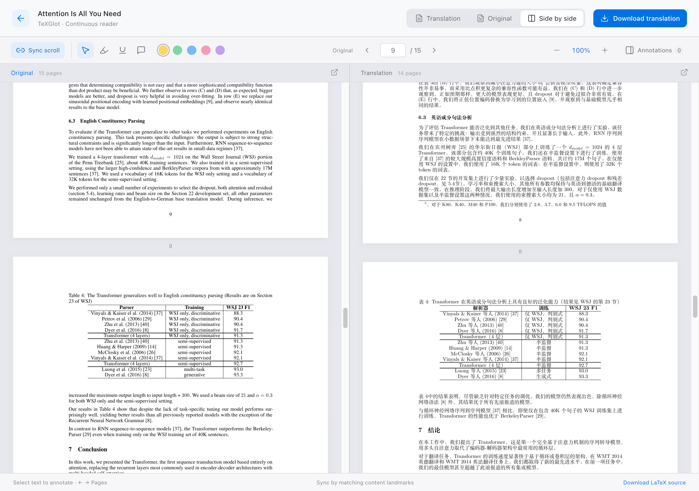

<p align="center">
  
</p>
<h1 align="center">TeXGlot</h1>
<p align="center"><strong>Read papers across languages. Keep the LaTeX.</strong></p>
<p align="center">Local arXiv &amp; LaTeX translation · Your model API · PDF + editable source</p>
<p align="center">
  <a href="LICENSE"></a>
  <a href="docs/platforms.en.md"></a>
  <a href="docs/platforms.en.md"></a>
  <a href="pyproject.toml"></a>
</p>
<p align="center"><strong>English</strong> · <a href="README_CN.md">简体中文</a></p>
<p align="center">
  <a href="#quick-start">Quick start</a> · <a href="#example-attention-is-all-you-need">Example</a> · <a href="#command-line">CLI</a> · <a href="CONTRIBUTING.md">Contributing</a> · <a href="docs/releases/v1.0.2.md">Release notes</a>
</p>


https://github.com/user-attachments/assets/0f7d9dbb-3daf-412e-b3db-6f328421c396


## Overview

**TeXGlot** takes an arXiv link or a LaTeX project, translates its prose with your configured language model, and compiles a translated PDF. Equations, citations, figures and document structure are protected throughout the process. The translated LaTeX project remains available for editing.

The name combines **TeX + Polyglot**. The browser interface and CLI use the same local library, queue and translation cache. No TeXGlot account or hosted backend is required. Model requests go to the API endpoint you choose.

## Features

| | What you can do |
| :--- | :--- |
| **Source to PDF** | Import arXiv links/IDs or `.tex`, `.zip`, `.tar`, `.tar.gz`, `.tgz`, `.gz` projects. Download the translated PDF, original PDF and translated source ZIP. |
| **Your model** | Use Qwen / Alibaba Model Studio, DeepSeek, or a compatible Chat Completions endpoint, including a local model service. |
| **Context guidance** | Optionally use the paper's abstract to guide terminology. On by default; independently selectable for each task in the GUI and CLI. |
| **Reading workspace** | Read original, translation or both; scroll continuously, synchronize by shared content landmarks, zoom and resume your reading position. |
| **Local annotations** | Highlight, underline and add notes. Search and manage annotations in a sidebar; exported PDFs stay free of TeXGlot annotations. |
| **Batch & resume** | Translate multiple papers from the terminal, resume interrupted tasks, reuse valid paragraph caches and export machine-readable results. |
| **Two interface languages** | Chinese and English UI, independently of the translation target: Simplified Chinese, Traditional Chinese or English. |

<p align="center"></p>
<p align="center"><sub>Actual TeXGlot reader showing aligned prose and experimental results from <a href="https://arxiv.org/abs/1706.03762v7">Attention Is All You Need</a> (Vaswani et al., NeurIPS 2017).</sub></p>

## Quick start

### 1. Download and install

Choose the **desktop installer** for your computer from [Releases](https://github.com/Mengqi-Lei/texglot/releases):

| Computer | Installer | Install |
| :--- | :--- | :--- |
| Mac · Apple Silicon | `TeXGlot-1.0.2-macOS-arm64.dmg` | Open and drag into Applications |
| Mac · Intel | `TeXGlot-1.0.2-macOS-x64.dmg` | Open and drag into Applications |
| Windows · x64 | `TeXGlot-1.0.2-Windows-x64-Setup.exe` | Run setup and open the desktop shortcut |

Python, the interface and Tectonic are included. **No Python, Node.js or uv installation is required.** First compilation downloads TeX packages and fonts; papers with EPS figures additionally require Ghostscript. The initial packages have no publisher signing certificate / Apple notarization, so the OS may show an unknown-publisher warning. See the [desktop guide](docs/desktop.md) for installation, migration and platform validation. Only verified assets are attached to a release.

<details>
<summary>Install from source (developers and CLI users)</summary>

Download and extract **`texglot-1.0.2-source.zip`** from [Releases](https://github.com/Mengqi-Lei/texglot/releases), or clone the repository:

```bash
git clone https://github.com/Mengqi-Lei/texglot.git
cd texglot
```

Install [uv](https://docs.astral.sh/uv/getting-started/installation/) and [Node.js 22.12+](https://nodejs.org/en/download), then reopen your terminal. Setup prepares Python 3.13, builds the interface and installs the CLI. It reuses an installed Tectonic compiler, or downloads a checksum-verified portable copy. The first installation and first compilation need internet access for dependencies, TeX packages and fonts.

**macOS**

```bash
bash scripts/setup.sh
bash start-texglot.command
```

After installation, you can also double-click `start-texglot.command` in Finder.

**Windows 10/11 x64**

Double-click `install-texglot.cmd`, then `start-texglot.cmd`. Alternatively, in PowerShell:

```powershell
.\install-texglot.cmd
.\start-texglot.cmd
```

No WSL is required. For source installations, prefer a short folder such as `D:\TeXGlot`. The Apple Silicon desktop app was tested locally. Intel Mac and Windows x64 passed native builds and frozen-engine translation checks; Windows also passed EXE installation. See [platform details](docs/platforms.en.md) for interactive desktop and Linux test coverage.

</details>

### 2. Connect your model

Open **TeXGlot** (or **http://127.0.0.1:8765** for a source installation), choose **Model settings**, select a provider, enter its API base URL, model and key, then **Test connection** and save.

| Provider | Model preset | API base URL |
| :--- | :--- | :--- |
| Qwen / Alibaba Model Studio | `qwen3.7-plus` | Copy the **OpenAI-compatible** endpoint from your workspace's API Key page. It must match the key's region and workspace. |
| DeepSeek | `deepseek-v4-flash` | `https://api.deepseek.com` |
| Custom / local | Your installed or available model | For example, `http://localhost:11434/v1` for Ollama. A local endpoint without authentication can use an empty key. |

Presets are editable. Model availability and billing depend on your provider account. Qwen requests disable thinking by default. Refer to the [Qwen quick start](https://help.aliyun.com/zh/model-studio/first-api-call-to-qwen) or [DeepSeek documentation](https://api-docs.deepseek.com/) for credentials and endpoint details.

### 3. Translate and read

Paste an arXiv link, or upload a LaTeX project including its figures, bibliography and template files. Choose the target language and context guidance, then click **Translate**. Open the result to compare the PDFs or download the translated source.

The interface starts in Chinese; use **EN** in the header to switch. The empty library's **Translate Attention Is All You Need** action downloads the pinned arXiv paper and translates it using your selected target language, context guidance and configured API. Quit the desktop app through its menu. For a source installation, close the launch terminal or press `Ctrl+C` to stop the foreground service; your library is retained.

## Example: Attention Is All You Need

Try the original Transformer paper, pinned to [arXiv:1706.03762v7](https://arxiv.org/abs/1706.03762v7):

```bash
texglot https://arxiv.org/abs/1706.03762v7 --language zh --context-guidance -o ./translated
```

The [bilingual walkthrough](examples/attention-is-all-you-need/README.md) covers the GUI, CLI, expected artifacts and result checks. A one-line [batch file](examples/attention-is-all-you-need/papers.txt) is included. This is a real model-backed translation and incurs your provider's normal usage charges.

The example downloads source from arXiv when you run it. The repository does not redistribute the paper, its source archive or its full translation.

## Command line

Desktop packages include a [CLI engine](docs/desktop.md#bundled-command-line); source or wheel installation provides the shorter commands below. No browser needs to be open:

```bash
texglot --configure                         # interactive setup; hidden key input
texglot 1706.03762v7                         # one paper
texglot ./paper.tex ./project.zip -o ./out   # multiple inputs
texglot --batch papers.txt --language zh    # one source per line
texglot --batch papers.txt --no-context-guidance
texglot --resume TASK_ID                    # resume, wait or export
texglot --list
texglot --serve                             # foreground local web service
```

If the command is not found, run `uv tool update-shell` and reopen the terminal. From the checkout, `uv run python -m app.cli` accepts the same arguments.

Batch lists support comments and resolve relative input paths from the list's directory. Each task exports into a separate folder. A failed paper does not stop later papers unless you pass `--fail-fast`. `--json` writes results to stdout and progress to stderr; exit code `1` includes partial translations that need review. See the [complete CLI guide](docs/cli.en.md).

## How translation works

1. **Import and preflight.** Safely unpack the source, find the main file and compile the original. Check the target-language font/template before model translation.
2. **Protect and translate.** Extract prose, protect LaTeX syntax, formulas and references with markers, then call the configured model with bounded concurrency.
3. **Use context when enabled.** Share the explicitly marked source abstract across paragraphs, up to 6,000 characters. No readable abstract means no added context. Turning guidance off removes this background, while terminology and structure protection still apply.
4. **Validate and cache.** Check protected markers, structure and target language. Retry invalid output; preserve the original paragraph and report a partial result if recovery fails. Save successful translations for resumption.
5. **Compile and export.** Rebuild the LaTeX project into a searchable PDF and retain editable source. Read the result locally with content-based synchronization.

## Data and privacy

- Source installations store settings, tasks, caches and annotations in **`data/`**; desktop and standalone wheel installations use **`~/.texglot/`**. `TEXGLOT_DATA_DIR` overrides the location. Back up this directory before moving or upgrading an installation.
- API keys are stored locally, **not encrypted at rest**. Configuration files use owner-only permissions on macOS/Linux and the containing user's ACL on Windows. API responses do not expose saved keys. A new API address does not inherit another address's key.
- Translation paragraphs, optional abstract context and your glossary are sent to your chosen model service. Source processing, compilation and annotation storage run locally. Use a local model endpoint if the text must remain on your machine.
- The service binds to loopback. It is a personal local application, not an authenticated multi-user server. macOS uses an OS compilation sandbox; Windows/Linux do not yet provide equivalent OS-level file isolation. Use trusted LaTeX sources.

## Help

See the [scope and troubleshooting guide](docs/troubleshooting.md) for supported inputs, template compatibility and solutions to common issues.

## Development and contributions

Contributions to translation quality, templates, accessibility, documentation and platform testing are welcome. Start with the [English contribution guide](CONTRIBUTING.md) or [中文贡献指南](CONTRIBUTING_CN.md) for local development, architecture, test commands, commit conventions and pull requests.

## Acknowledgements and license

TeXGlot was inspired by [幻觉翻译](https://hjfy.top/) and draws on its related features. TeXGlot is independently implemented. Thanks to the maintainers of Tectonic, PDF.js, React, FastAPI and the other dependencies listed in [THIRD_PARTY.md](THIRD_PARTY.md).

TeXGlot is licensed under **[Apache License 2.0](LICENSE)**. Bundled fonts, character maps and other third-party resources retain their respective licenses. Research papers used with the tool retain their original rights.
