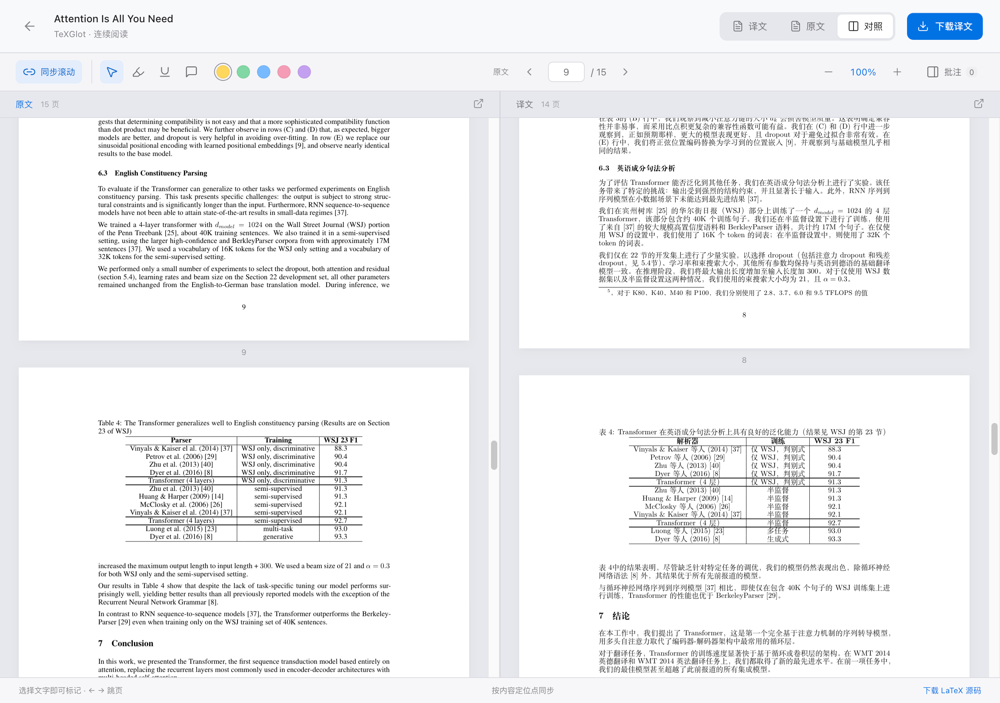

<p align="center">
  
</p>
<h1 align="center">TeXGlot</h1>
<p align="center"><strong>跨越语言阅读论文，保留熟悉的 LaTeX。</strong></p>
<p align="center">本地 arXiv 与 LaTeX 翻译 · 自选模型 API · PDF 与可编辑源码</p>
<p align="center">
  <a href="LICENSE"></a>
  <a href="docs/platforms.md"></a>
  <a href="docs/platforms.md"></a>
  <a href="pyproject.toml"></a>
</p>
<p align="center"><a href="README.md">English</a> · <strong>简体中文</strong></p>
<p align="center">
  <a href="#快速开始">快速开始</a> · <a href="#案例attention-is-all-you-need">案例</a> · <a href="#命令行">CLI</a> · <a href="CONTRIBUTING_CN.md">参与贡献</a> · <a href="docs/releases/v1.0.5_CN.md">版本说明</a>
</p>


https://github.com/user-attachments/assets/c77fea68-7ade-4027-8ef2-7198465390d7


## 简介

**TeXGlot** 将 arXiv 链接或 LaTeX 工程中的正文交给你配置的大模型翻译，保护公式、引用、图片和文档结构，再编译为译后 PDF。译后的 LaTeX 工程也可下载，方便继续编辑。

名称来自 **TeX + Polyglot**。网页和 CLI 共用本机文献库、任务队列与译文缓存，无需注册 TeXGlot 账号或连接 TeXGlot 云端。模型请求发送到你选择的 API 服务。

## 功能

| | 可以做什么 |
| :--- | :--- |
| **源码到 PDF** | 导入 arXiv 链接、ID 或 `.tex`、`.zip`、`.tar`、`.tar.gz`、`.tgz`、`.gz` 工程，下载译文 PDF、原文 PDF 和译后源码 ZIP。 |
| **自选模型** | 支持 Qwen / 阿里云百炼、DeepSeek，以及兼容 Chat Completions 的服务，包括本地模型。 |
| **上下文引导** | 可用论文摘要辅助理解主题与术语，初始默认开启；每项任务都可在界面或 CLI 独立选择。 |
| **论文阅读** | 原文、译文和左右对照，左右互换、连续纵向阅读，按共同内容定位点同步滚动，缩放并恢复阅读位置。 |
| **本地批注** | 高亮、下划线和便签，通过侧栏搜索与管理；导出的 PDF 不附带 TeXGlot 批注。 |
| **批量与恢复** | 终端批量翻译，恢复中断任务，复用有效的段落缓存，导出适合脚本读取的结果。 |
| **桌面更新** | 应用内提醒新版本，下载并校验安装包，确认后打开安装器。[更新说明](docs/desktop_CN.md#更新提醒)。 |
| **双语界面** | 中英文界面独立切换；翻译目标可选简体中文、繁体中文或英文。 |

<p align="center"></p>
<p align="center"><sub>真实阅读器截图，展示 <a href="https://arxiv.org/abs/1706.03762v7">Attention Is All You Need</a> 中的正文与实验结果对照（Vaswani 等，NeurIPS 2017）。</sub></p>

## 快速开始

### 1. 下载与安装

从 [Releases](https://github.com/Mengqi-Lei/texglot/releases) 选择与你的电脑对应的**桌面安装包**：

| 电脑 | 安装包 | 使用方式 |
| :--- | :--- | :--- |
| Mac · Apple Silicon | `TeXGlot-1.0.5-macOS-arm64.dmg` | 打开后拖入 Applications |
| Mac · Intel | `TeXGlot-1.0.5-macOS-x64.dmg` | 打开后拖入 Applications |
| Windows · x64 | `TeXGlot-1.0.5-Windows-x64-Setup.exe` | 双击安装，打开桌面快捷方式 |

安装包内置 Python、网页界面和 Tectonic，**无需安装 Python、Node.js 或 uv**。首次编译需要联网下载 TeX 宏包与字体；含 EPS 插图的论文还需要安装 Ghostscript。首批安装包尚未经过发布者签名／Apple 公证，系统可能显示未知发布者提示；平台验证状态、数据迁移与安装说明见[桌面指南](docs/desktop_CN.md)。只提供已验证的 Release 附件。

<details>
<summary>从源码安装（开发者与 CLI 用户）</summary>

从 [Releases](https://github.com/Mengqi-Lei/texglot/releases) 下载并解压 **`texglot-1.0.5-source.zip`**，或克隆仓库：

```bash
git clone https://github.com/Mengqi-Lei/texglot.git
cd texglot
```

安装 [uv](https://docs.astral.sh/uv/getting-started/installation/) 和 [Node.js 22.12+](https://nodejs.org/en/download)，然后重新打开终端。安装脚本会准备 Python 3.13、构建网页并安装 CLI；已有 Tectonic 时直接使用，否则下载经过校验的便携编译器。首次安装和编译需要联网获取依赖、TeX 宏包与字体。

**macOS**

```bash
bash scripts/setup.sh
bash start-texglot.command
```

安装后，也可以在 Finder 中双击 `start-texglot.command`。

**Windows 10/11 x64**

双击 `install-texglot.cmd`，完成后双击 `start-texglot.cmd`。也可在 PowerShell 中运行：

```powershell
.\install-texglot.cmd
.\start-texglot.cmd
```

无需 WSL。源码安装建议使用 `D:\TeXGlot` 等较短目录。Apple Silicon Mac 已完成桌面实测；Intel Mac 与 Windows x64 已通过原生构建及包内翻译流程，Windows 另通过 EXE 安装验证。Windows 客户端交互与 Linux 实测范围见[平台说明](docs/platforms.md)。

</details>

### 2. 连接模型

打开 **TeXGlot**（源码版访问 **http://127.0.0.1:8765**），进入 **模型设置**，选择服务商，填写 API 地址、模型与密钥，点击 **测试连接** 后保存。

| 服务商 | 预设模型 | API 地址 |
| :--- | :--- | :--- |
| Qwen / 阿里云百炼 | `qwen3.7-plus` | 从业务空间的 API Key 页面复制 **OpenAI 兼容地址**，须与密钥的地域和业务空间一致。 |
| DeepSeek | `deepseek-v4-flash` | `https://api.deepseek.com` |
| 自定义 / 本地模型 | 已安装或有权限使用的模型 | 例如 Ollama 的 `http://localhost:11434/v1`；本地无鉴权服务可以不填密钥。 |

预设均可修改，模型权限和费用由服务商账户决定。Qwen 请求默认关闭深度思考。密钥与接口信息可参考 [千问首次调用](https://help.aliyun.com/zh/model-studio/first-api-call-to-qwen) 和 [DeepSeek 文档](https://api-docs.deepseek.com/zh-cn/)。

### 3. 翻译与阅读

粘贴 arXiv 链接，或上传包含图片、参考文献和模板文件的 LaTeX 工程。选择翻译语言与上下文引导，点击 **开始翻译**。完成后打开阅读器对照阅读，或下载译后源码。

界面默认中文，页眉 **EN** 可切换英文。空文献库中的 **翻译 Attention Is All You Need** 会下载固定版本的 arXiv 论文，按当前目标语言、上下文引导和已配置 API 进行翻译。桌面版通过菜单退出；源码版关闭启动终端或按 `Ctrl+C` 停止前台服务，已有文献会保留。

## 案例：Attention Is All You Need

使用原始 Transformer 论文，固定版本为 [arXiv:1706.03762v7](https://arxiv.org/abs/1706.03762v7)：

```bash
texglot https://arxiv.org/abs/1706.03762v7 --language zh --context-guidance -o ./translated
```

[双语案例说明](examples/attention-is-all-you-need/README_CN.md) 包含网页和 CLI 操作、预期产物及检查方法，同时提供可直接使用的 [批量清单](examples/attention-is-all-you-need/papers.txt)。案例会实际调用模型，产生服务商正常计费的用量。

运行时从 arXiv 下载源码。仓库不重新分发论文全文、原始源码包或完整译文。

## 命令行

桌面版可以使用[安装包中的 CLI 引擎](docs/desktop_CN.md#安装包中的-cli)；以下简短命令由源码或 wheel 安装提供，无需先打开浏览器：

```bash
texglot --configure                         # 交互配置，密钥隐藏输入
texglot 1706.03762v7                         # 单篇论文
texglot ./paper.tex ./project.zip -o ./out   # 多个输入
texglot --batch papers.txt --language zh    # 每行一个来源
texglot --batch papers.txt --no-context-guidance
texglot --resume TASK_ID                    # 恢复、等待或导出
texglot --list
texglot --serve                             # 前台运行本地网页服务
```

找不到命令时，运行 `uv tool update-shell` 并重新打开终端。在源码目录中也可用 `uv run python -m app.cli`，参数完全相同。

批量清单支持注释，其中的相对路径以清单所在目录为基准。每项任务输出到独立文件夹；单篇失败后继续处理后续论文，`--fail-fast` 可改为遇错停止。`--json` 将结果写入标准输出、进度写入标准错误；退出码 `1` 也包含需要检查的部分翻译。详见 [完整 CLI 说明](docs/cli.md)。

## 翻译流程

1. **导入与预检。** 安全解压源码，识别主文件，编译原文；在调用模型前检查目标语言字体和模板兼容性。
2. **保护与翻译。** 提取正文，用占位标记保护 LaTeX 语法、公式和引用，在有限并发下调用模型。
3. **按需引入背景。** 开启上下文引导时，各段共用源码中明确标记的摘要，最多 6,000 字符；未识别到可读摘要则不附加背景。关闭后移除摘要背景，术语表和结构保护仍有效。
4. **校验与缓存。** 检查标记、结构和目标语言，重试异常输出；修复失败时保留该段原文并报告部分完成。成功译文立即缓存，便于继续任务。
5. **编译与导出。** 重新编译为可搜索的 PDF，同时保留可编辑源码，在本地按共同内容定位点对照阅读。

## 数据与隐私

- 源码安装的数据保存在 **`data/`**，桌面版与独立 wheel 安装保存在 **`~/.texglot/`**。环境变量 `TEXGLOT_DATA_DIR` 可修改位置。迁移或升级前请备份该目录。
- API 密钥保存在本地，**未做静态加密**。macOS/Linux 配置文件仅允许文件所有者读写，Windows 依赖所在用户目录的 ACL。API 响应不返回已保存密钥，新地址也不会继承其他服务地址的密钥。
- 当前段落、可选摘要背景和术语表会发送到你选择的模型服务；源码处理、编译和批注保存在本机。需要文本始终留在本机时，可配置本地模型。
- 服务仅绑定回环地址，是个人本地应用，不是带身份验证的多人服务器。macOS 使用系统编译沙箱，Windows/Linux 尚无同等级的 OS 文件隔离，请使用可信 LaTeX 源码。

## 使用帮助

输入要求、模板兼容与常见问题的处理方法，请参阅[使用范围与排错指南](docs/troubleshooting_CN.md)。

## 二次开发与贡献

欢迎改进翻译质量、模板兼容性、无障碍交互、文档和平台支持。[中文贡献指南](CONTRIBUTING_CN.md) 与 [English contribution guide](CONTRIBUTING.md) 包含环境搭建、目录结构、测试命令、提交约定和 Pull Request 流程。

## 致谢与许可

本项目受到 [幻觉翻译](https://hjfy.top/) 的启发，并参考了其相关功能。本项目独立实现。感谢 Tectonic、PDF.js、React、FastAPI 及 [THIRD_PARTY.md](THIRD_PARTY.md) 中各项依赖的维护者。

TeXGlot 采用 **[Apache License 2.0](LICENSE)**。字体、字符映射等第三方资源保留各自许可；使用本工具处理的论文仍受其原有权利约束。
