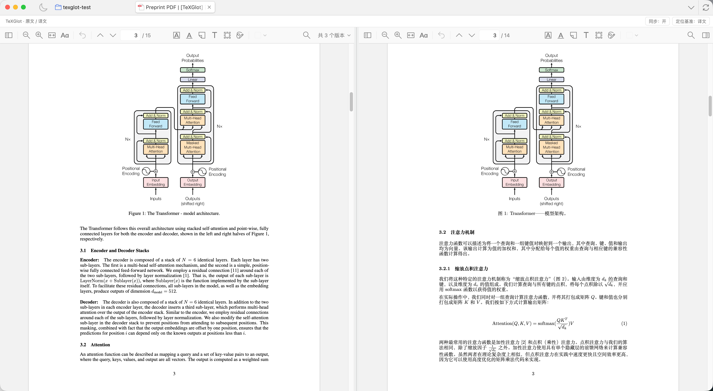

# TeXGlot 1.2.0 · Zotero plugin 1.0.0

**English** · [简体中文](v1.2.0_CN.md)

TeXGlot now connects directly to Zotero: start a translation from your library, reuse an existing result and read both PDFs side by side in Zotero's native reader. This release also fixes two template-related failures that could stop a paper before any model request.

## Zotero integration

- **Translate from your library.** Use the item context menu for arXiv papers or attached LaTeX projects. PDFs remain attached to the original bibliographic item.
- **Reuse before translating.** Find results across your local TeXGlot library, including tasks created from the App, browser or CLI. Matching requires the same complete arXiv version and target language, or the same uploaded source and main-file selection. Existing active tasks are followed; explicit retranslation is available separately.
- **Resolve versions automatically.** Read PDF version stamps and attachment metadata without asking users to type `v1` or `v2`. When a local version cannot be confirmed, offer the official version with its matching original while keeping existing files and annotations.
- **Read inside Zotero.** Native split view supports scrolling from either pane, resizing, per-pane search and annotations, and restored reading tabs. Double-click a paper with a unique translation to open comparison; a persistent context-menu setting restores ordinary single-PDF opening.
- **See translation availability.** A TG-icon column shows saved translations, activity and review status. The header and plugin menus use the TeXGlot app logo.
- **Avoid accidental retranslation.** An older core without library reuse produces an update prompt instead of silently using the legacy create endpoint.

Installation and usage: [Zotero plugin guide](../../integrations/zotero/README.md).

## Translation fixes

- Keep deterministic target-font preflight separate from model-output validation, so mixed letter/number names do not incorrectly fail source restoration before translation.
- Handle pdfTeX-only PDF date and file-ID settings in the shared XeTeX compatibility layer. Preserve scientific content, literal examples, diagnostic line positions and unknown-command failures.

## Downloads

| Asset | Use |
| --- | --- |
| `TeXGlot-1.2.0-macOS-arm64.dmg` | Apple Silicon Mac |
| `TeXGlot-1.2.0-macOS-x64.dmg` | Intel Mac |
| `TeXGlot-1.2.0-Windows-x64-Setup.exe` | Windows x64, per-user installation |
| `texglot-zotero-1.0.0.xpi` | Zotero 9 plugin; install from Tools → Plugins |
| `texglot-zotero-update.json` | Plugin update manifest, consumed by Zotero |
| `texglot-1.2.0-source.zip` | Public source, plugin source and setup scripts |
| `texglot-1.2.0-py3-none-any.whl` | Python package with the built interface |
| `texglot-1.2.0.tar.gz` | Python source distribution |
| `SHA256SUMS.txt` | SHA-256 checksums for all downloads |

## Upgrade and compatibility

Install **both TeXGlot 1.2.0 and the plugin XPI**. Quit the older App/service and reopen after installation; updating source files or the XPI alone does not replace a running older core. Existing settings, papers, paragraph caches and annotations remain in your data directory. Failed template tasks can use **Resume / Retry** after upgrading.

The plugin targets **Zotero 9**; interactive testing used macOS Zotero 9.0.6. Do not infer Windows, Linux or another Zotero major version's plugin compatibility from desktop-engine build results. Zotero split scrolling currently uses page and page-local positions, not sentence-level alignment. Arbitrary PDF-to-LaTeX/OCR input is not included. New translations use your configured provider and its normal usage charges; matching completed results make no model requests.

Desktop installers remain without Apple notarization or a Windows publisher certificate. See the [desktop guide](../desktop.md) for installation and update details.

[Changes since 1.1.3](https://github.com/Mengqi-Lei/texglot/compare/v1.1.3...v1.2.0).
